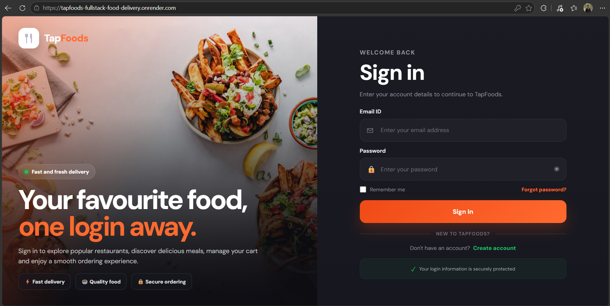
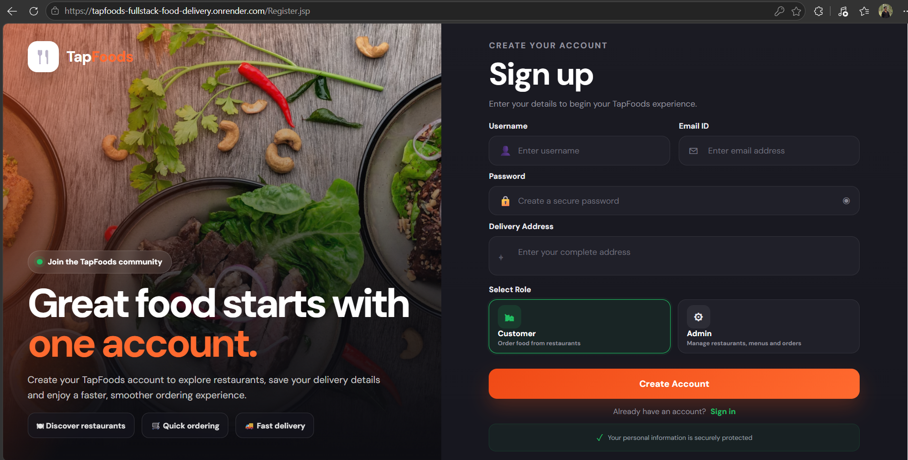
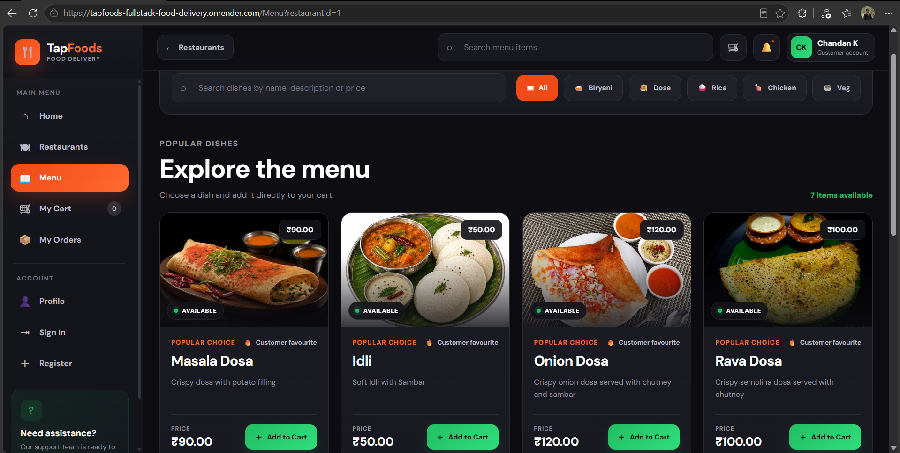
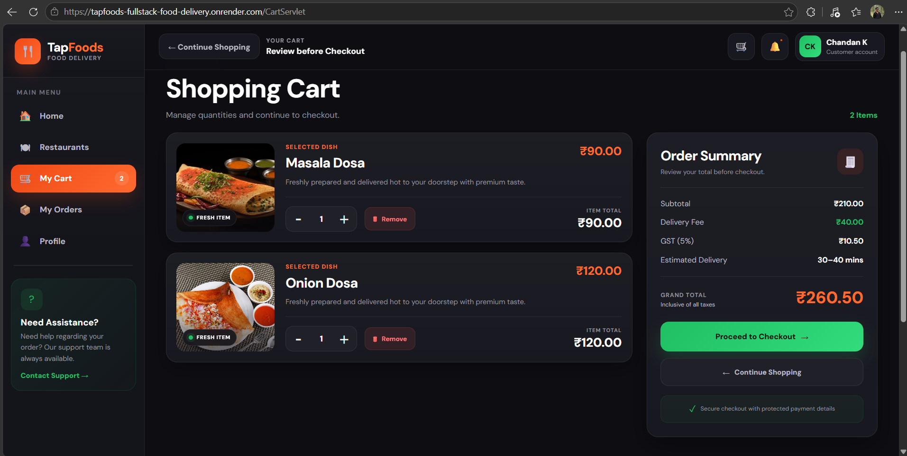
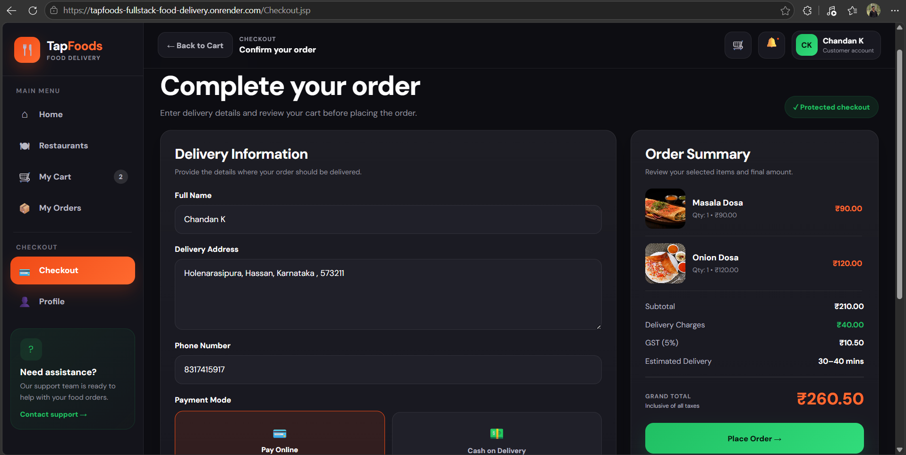
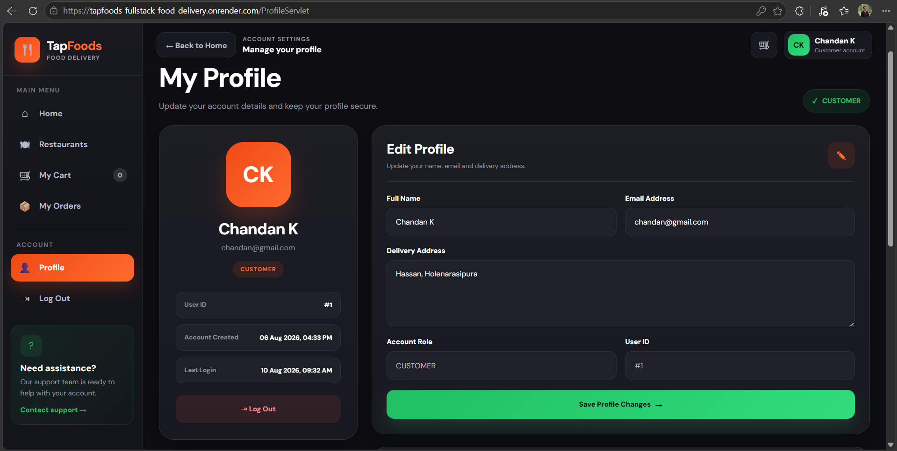

# 🍔 TapFoods - Full Stack Food Delivery Web Application

> A Full Stack Food Delivery Web Application built using Java, JSP, Servlets, JDBC, MySQL, HTML, CSS, JavaScript, BCrypt and Razorpay.

---

## 🚀 Project Overview

TapFoods is a full-stack food delivery web application that allows users to securely register and log in, browse restaurants, explore menus, search food items, manage a shopping cart, place orders, make online payments, manage their profile, and track previous orders through a responsive and user-friendly interface.

The customer module is fully functional with secure authentication, complete ordering workflow, Cash on Delivery, and Razorpay Test Mode payment integration.

---

# ✨ Features

## 🔐 Authentication

- Secure User Registration
- BCrypt Password Hashing
- Secure Login
- Session Management
- Change Password
- Logout

---

## 🍽 Restaurant & Menu Module

- Browse Restaurants
- Search Restaurants
- View Restaurant Menu
- Search Food Items
- View Food Details

---

## 🛒 Shopping Cart

- Add Items to Cart
- Update Item Quantity
- Remove Items
- Automatic Price Calculation
- Dynamic Grand Total

---

## 💳 Checkout & Payments

- Customer Delivery Details
- Delivery Address
- Cash on Delivery (COD)
- Razorpay Payment Gateway Integration
- Razorpay Test Mode Payments
- Secure Payment Verification
- Razorpay Order ID Management
- Razorpay Payment ID Management
- Payment Signature Verification
- Payment Status Storage
- Order Confirmation
- Order Success Page

---

## 📦 Order Management

- Place Orders
- Order History
- Search Orders
- Order Status Tracking
- Cancel Orders
- View Ordered Items
- Payment Method Information

---

## 👤 User Profile

- View Profile
- Edit Profile
- Update Delivery Address
- Change Password

---

# 🛠 Technology Stack

### Frontend

- HTML5
- CSS3
- JavaScript
- JSP

### Backend

- Java
- Jakarta Servlets
- JDBC
- DAO Architecture

### Database

- MySQL

### Security

- BCrypt Password Hashing
- Session-Based Authentication
- Razorpay Payment Signature Verification

### Payment Gateway

- Razorpay

### Server

- Apache Tomcat 10

### IDE

- Eclipse IDE

### Version Control

- Git
- GitHub

---

# 📂 Project Structure

```text
FoodDelivery
│
├── src/main/java
│   └── com.food
│       ├── DAO
│       ├── DAOImpl
│       ├── Model
│       ├── servlets
│       └── utility
│
├── src/main/webapp
│   ├── images
│   ├── WEB-INF
│   │   └── lib
│   ├── Cart.jsp
│   ├── Checkout.jsp
│   ├── Login.jsp
│   ├── Menu.jsp
│   ├── MyOrders.jsp
│   ├── OrderSuccess.jsp
│   ├── Profile.jsp
│   ├── RazorpayPayment.jsp
│   ├── Register.jsp
│   └── Restaurant.jsp
│
└── Database
---

# 🔄 Application Workflow

The complete customer ordering workflow is:

1. User creates an account or logs in securely.
2. User browses available restaurants.
3. User selects a restaurant and explores its menu.
4. User searches and adds food items to the cart.
5. User updates quantities or removes unwanted items.
6. User proceeds to checkout.
7. User enters delivery information.
8. User selects a payment method:
   - Cash on Delivery (COD)
   - Razorpay Online Payment
9. For online payments, a Razorpay order is created securely.
10. Razorpay processes the payment in Test Mode.
11. The backend verifies the Razorpay payment signature.
12. After successful verification, the order is stored in the database.
13. The user is redirected to the Order Success page.
14. The order becomes available in My Orders / Order History.

---

# 💳 Razorpay Payment Integration

TapFoods integrates Razorpay for secure online payment processing.

The payment implementation includes:

- Razorpay Order Creation
- Amount Conversion from Rupees to Paise
- Razorpay Checkout Integration
- Payment ID Handling
- Razorpay Order ID Handling
- HMAC SHA-256 Signature Verification
- Payment Verification on the Backend
- Payment Status Management
- Order Creation After Successful Payment Verification
- Razorpay Test Mode Support

> **Note:** The deployed project currently uses Razorpay Test Mode. No real money is charged while testing the application.

---

# 🔒 Security

Security features implemented in the application include:

- BCrypt password hashing
- Session-based authentication
- Protected customer pages
- Server-side payment verification
- Razorpay HMAC SHA-256 signature validation
- Environment-based configuration for sensitive deployment credentials
- User-specific order history
- Secure password change functionality

> API keys, database credentials, and other sensitive information should never be committed to the repository.

---

# 🖥️ Application Screenshots

## Login



## Registration



## Restaurant Dashboard


## Restaurant Menu



## Shopping Cart



## Checkout



## Razorpay Payment


## Order Success


## Order History


## User Profile



---

# 🚀 Deployment

The application is deployed as a Dockerized Java web application.

### Deployment Stack

- Java 21
- Apache Tomcat 10.1
- Docker
- Render
- MySQL
- GitHub

The Java Dynamic Web Project is exported as a WAR file and deployed inside an Apache Tomcat Docker container.

### Docker Configuration

```dockerfile
FROM tomcat:10.1-jdk21-temurin

RUN rm -rf /usr/local/tomcat/webapps/*

COPY FoodDelivery.war /usr/local/tomcat/webapps/ROOT.war

RUN sed -i 's/port="8005"/port="-1"/' /usr/local/tomcat/conf/server.xml && \
    sed -i 's/port="8080"/port="${PORT}"/' /usr/local/tomcat/conf/server.xml

ENV PORT=10000

EXPOSE 10000

CMD ["catalina.sh", "run"]
